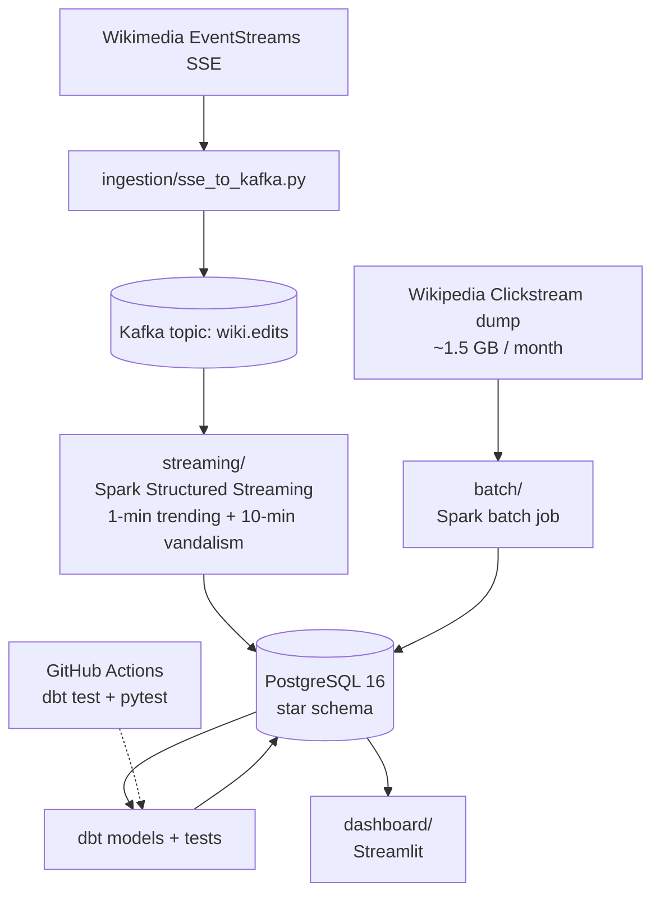

# wiki-edit-pipeline

Hybrid data engineering pipeline: live Wikipedia edit stream + historical Clickstream batch, with trending-page detection and vandalism flagging.

University Data Engineering final project (group of 2).

## Architecture



## Quickstart

```bash
cp .env.example .env
make up                    # kafka + postgres + producer + streaming + dashboard
make download-clickstream  # one-time, ~1.5 GB
make batch                 # one-shot Spark batch over Clickstream
make dbt && make dbt-test  # build star-schema marts and validate contracts
open http://localhost:8501 # live dashboard
```

## Layer mapping (assignment requirement)

| Layer       | Where                                                  |
|-------------|--------------------------------------------------------|
| Ingestion   | `ingestion/sse_to_kafka.py` (SSE → Kafka)              |
| Processing  | `streaming/stream_job.py` + `batch/clickstream_load.py`|
| Modelling   | `warehouse/ddl/` + `warehouse/er_diagram.mmd`          |
| Storage     | PostgreSQL 16 (named volume `postgres-data`)           |
| Serving     | `dashboard/app.py` (Streamlit, live + batch views)     |

## DataOps

- `dbt/` — staging + marts models with `unique` / `not_null` / `freshness` tests.
- `.github/workflows/ci.yml` — runs `dbt test` + pytest on every push.
- `docker-compose.yml` — single-command local stack.

## Layout

```
.
├── ingestion/         # SSE consumer → Kafka producer
├── streaming/         # Spark Structured Streaming job
├── batch/             # Spark batch over Clickstream dump
├── warehouse/         # Postgres DDL + Mermaid ER diagram
├── dbt/               # dbt models, tests, profiles
├── dashboard/         # Streamlit app
├── docs/report/       # Final report sections (drafted layer-by-layer)
├── tests/             # pytest tests
├── docker-compose.yml
├── Makefile
└── .env.example
```

## Window functions used (assignment requirement)

Implemented in `dbt/models/marts/`:

- `RANK() OVER (PARTITION BY date_trunc('minute', ts) ORDER BY edit_count DESC)` — trending pages per minute.
- `LAG(edit_count, 60) OVER (PARTITION BY page ORDER BY minute)` — edit-velocity acceleration as the breaking-news signal.
- 10-min sliding window grouped by `(page, editor_ip_class)` — vandalism signature: short bursts from anonymous IPs followed by reverts.

## Note on the working directory

The path `/Users/abdullah/Desktop/DE Project_bakr/` contains a space. Docker and Make handle this, but quote it (`"$PWD"`) in any shell scripts you add. Renaming to `de-project-bakr` would remove the friction entirely.
